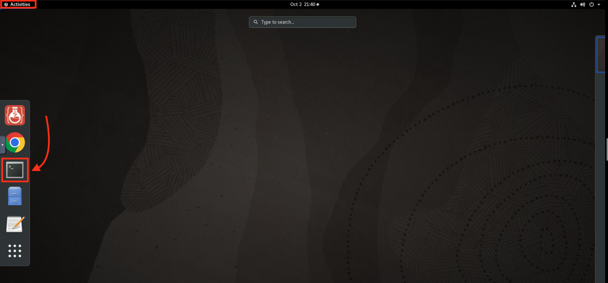
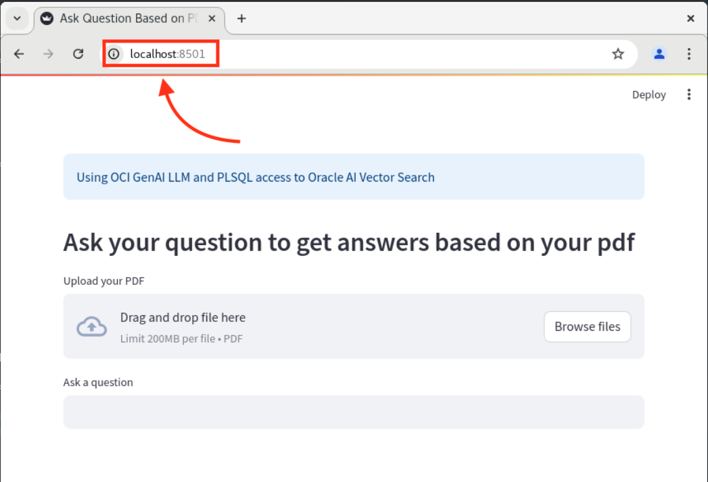

# Build a RAG Application with Oracle AI Vector Search and PLSQL

## Introduction

This lab will walk you through working with models, preprocessors and general python notebooks. By the end you will convert an image to text and should be familiar with the steps to run the next set of labs.

**_Estimated Lab Time: 15 minutes_**

### **Objectives**

In this lab, you will:
* Setup the necessary libraries
* Load various preprocessors and models
* Run the steps to convert an image to text

### **Prerequisites**

This lab assumes you have:
* Successfully completed all previous labs.

## Task 1: Launch the Jupyter Notebook

1. Return to the terminal. You can open a new window by doing the following:
    * Select 'Activities'.
    * Select the terminal icon.

    

2. Run the following commands to launch the Jupyter notebook. 

    ```
    <copy>
    cd /home/oracle/AIDemo
    jupyter lab
    </copy>
    ```

3. Reference the image below for details on how to navigate the notebook.


## (Optional) Task 2: Further Explore the RAG Application

You've now explored and built a RAG application. To test additional use-case scenarios, you may complete this lab.

1. Return to the Google Chrome window of the RAG application. 

    

2. If the application is no longer running, run the following command in the terminal and run the local url in Google Chrome.

    ```
    <copy>
    cd /home/oracle/AIdemo
    genai_run genai_plsql.py
    </copy>
    ```

    

3. Here are a few sample questions you can ask the application:

    For the Oracle Database 23ai Users Guide:
    - What are the new features in Oracle Database 23ai
    - Tell me more about AI Vector Search
    - Tell me more about new enhancement to SQL
    - Tell me more about JSON Relational Duality

    For the Oracle Fiscal Year 2024 Quarter 2 Financial Results document:
    - Summarize the Oracle 2024 Quarter 2 financial results
    - What did Larry say in the Oracle Fiscal Year 2024 Quarter 2 financial results

4. Once you're ready to optimize the response. Navigate to the local file system and upload the pdf that corresponds to your question, by doing the following:
    * Select 'Activities'.
    * Select the file drawer icon.
    * Select the file 'AI Vector Search User-Guide'.
    * Click 'Upload'.
    
    >**Remember, once the file is uploaded, it triggers the RAG workflow you built in Task 1.**

5. Re-enter the prompt, and observe the improvement in response quality. Repeat as desired!

You have completed the workshop!

## Acknowledgements
* **Author** - Brianna Ambler, Database Product Management
* **Contributors** -  Brianna Ambler, Database Product Management
* **Last Updated By/Date** - Brianna Ambler, October 2024
