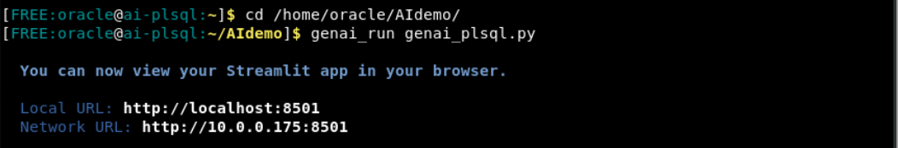
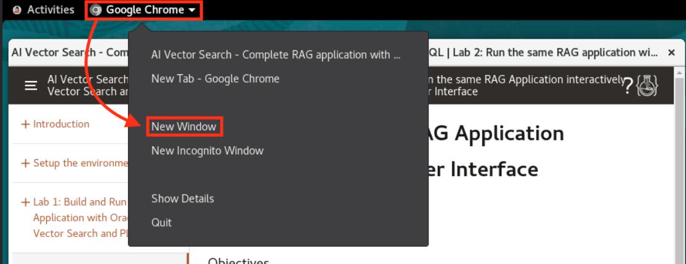
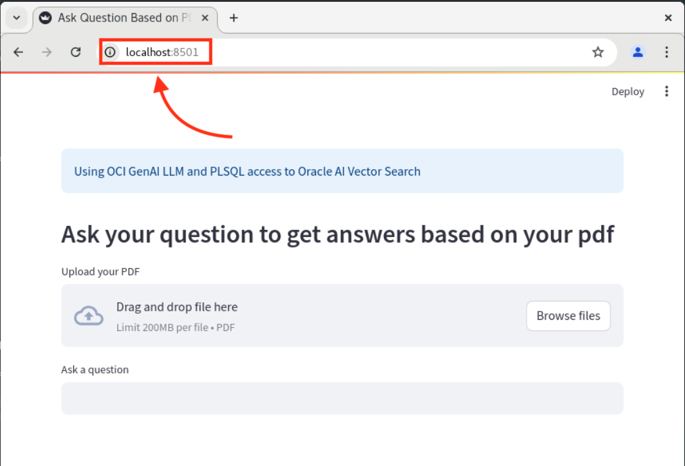

# Explore a RAG-Based Application

## Introduction

Have you ever received an LLM (Large Language Model) response that wasn't quite what you were looking for? No worries! With Oracle's RAG (Retrieval Augemented Generation) technology, you can easily fine-tune an LLM with your own data to improve the response quality without retraining the model. Before explaining how to do this, we want to show you! 

Imagine you wanted to learn more about Oracle's latest database version, Oracle Database 23ai. Well, a generic LLM likely won't have specific details on this topic. In this workshop, we'll be using RAG to help us feed Oracle-specific data into the model and have it better answer our 23ai-related questions. In this lab, we'll use the demo application, you will later build, to show you the difference in response quality before and after RAG. 

**_Estimated Lab Time: 10 minutes_**

### **Objectives**

In this lab, you will:
* Deploy the sample RAG application.
* Query the LLM on Oracle-specific data _without RAG_.
* Query the LLM on Oracle-specific data _with RAG_.
* Analyze the improvement in response quality.


### **Prerequisites**

This lab assumes you have:
* An Oracle LiveLabs Sandbox environment.


## Task 1: Deploy the RAG Application

1. Run the following command in the terminal to run the RAG application.

    ```
    <copy>
    cd /home/oracle/AIdemo
    genai_run genai_plsql.py
    </copy>
    ```

    

2. A new Google Chrome browser should have opened. If not, do the following:
    * Click into the window of the instruction guide.
    * Select **_Google Chrome_**, in the upper-left corner.
    * In the drop-down menu, select **_New Window_**.

    

3. Copy the Local URL from the terminal output of Step 1 and run it in the Chrome window. This will launch the user interface for the RAG application we started.

    

## Task 2: Analyze the LLM Response Quality

The application you're viewing is powered by a generic LLM. In this task, we'll let you query the LLM for information about one of Oracle's newest features, AI Vector Search. We'll then feed in official AI Vector Search docmentation, that our RAG workflow will use to refine our results. Let's get started! 

1. In the "Ask a Question" field, enter the following prompt:

    ```
    <copy>
    Tell me about Oracle AI Vector Search.
    </copy>
    ```

2. Notice that the returned response is vague and doesn't include Oracle-specific information. This is because our application is powered by a generic LLM that wasn't trained specifically on Oracle's data.

3. A few Oracle documents have been pre-loaded into the file system. Let's upload the AI Vector Search User-Guide. Navigate to the local file system, by doing the following:
    * Select 'Activities'.
    * Select the file drawer icon.
    * Select the file 'AI Vector Search User-Guide'.
    * Click 'Upload'.

Once the file is uploaded, it triggers the RAG workflow--which we'll show you how to build shortly. On a high-level, this process vectorizes the new document and allows the LLM to reference those vectors when generating its response. 

4. Let's see how much our application can tell us about Oracle AI Vector Search, now that it has some more Oracle data. Re-enter the following prompt:

    ```
    <copy>
    Tell me about Oracle AI Vector Search.
    </copy>
    ```

5. Let's review the primary differences in response quality.

    * Difference 1
    * Difference 2
    * Difference 3

Nice, you're now ready to see how we built the RAG workflow! **You may proceed to the next lab.**

## Acknowledgements
* **Author** - Brianna Ambler, Database Product Management
* **Contributors** -  Brianna Ambler, Database Product Management
* **Last Updated By/Date** - Brianna Ambler, October 2024
